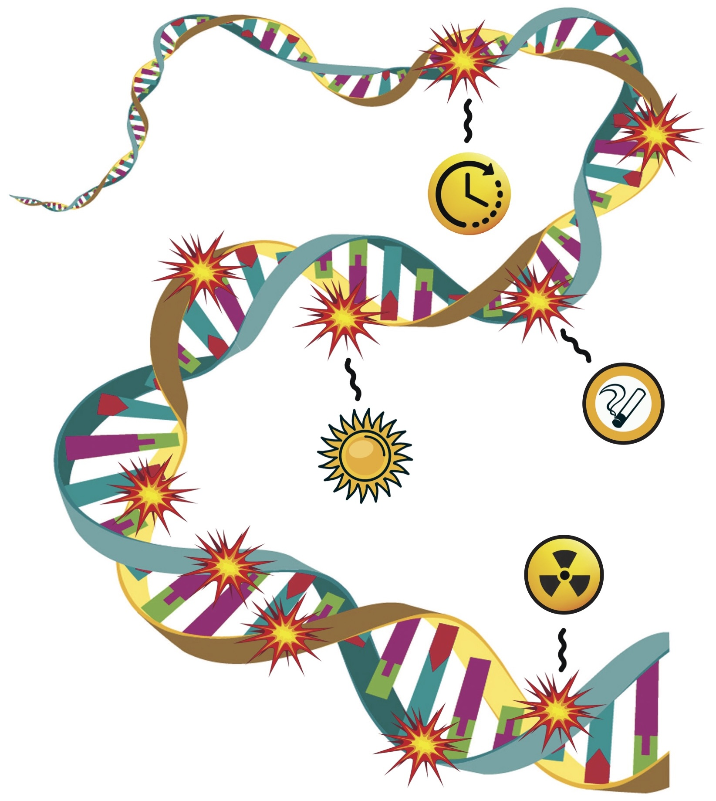

# GENAsims

**GENAsims** generates realistic somatic mutations for different mutagens (e.g., APOBEC, UV) by sampling across genomic features such as replication timing bins, gene vs intergenic regions, and transcription/replication strands. 

## Installation

To install GENAsims from GitHub navigate to a directory where you want to install the program and clone the repository:
```
git clone https://github.com/KazanovLab/GENAsims
```

To compile GENAsims and install it system-wide navigate into the cloned directory and run:
```
cd GENAsims
make
sudo make install
```

## Quick start

GENAclust can generate output in short, full, or both formats simultaneously.
* The short output (-s option) includes only mutations that are part of the identified clusters.
* The full output (-f option) contains all mutations from the input VCF files.

Other options include:
* The input directory containing VCF file (specified after the -s/-f options)
* The reference genome location (-g).
* The output directory (-o).
* The p-value for determining the between-mutation distance threshold (-t, default: 0.01).

Examples:

Short format output:
```
genaclust -s /inputdir/ -o /outputdir/ -g /refgenome/hg19.fa
```

Full format output:
```
genaclust -f /inputdir/ -o /outputdir/ -g /refgenome/hg19.fa
```

Both short and full output:
```
genaclust -sf /inputdir/ -o /outputdir/ -g /refgenome/hg19.fa
```

## Reporting Bugs and Feature Requests
Please use the [GitHub issue tracker](https://github.com/KazanovLab/GENAsims/issues) to report bugs or suggest features.

## Citing
*to be submitted*

## Funding
This study was supported by the Scientific and Technological Research Council of Turkey (TUBITAK) under Grant Number 123E476. The authors thank TUBITAK for their support. 

